# SMU 2023.1

Projeto aos moldes do [semestre 2011.1](https://github.com/boidacarapreta/smu20211/milestones?direction=asc&sort=due_date&state=closed).

## Máquinas de estado

Registro e entrada na sala de partida:

```mermaid
stateDiagram-v2
    [*] --> WebSocket
 WebSocket --> Registro : "registro"
    state if_registro <<choice>>
    Registro -->  if_registro
    if_registro --> Registro_negado: "Não_registrado"
    if_registro -->  Registro_autorizado: "registro-aceito"
     Registro_negado --> [*]
     Registro_autorizado --> Entrar_Na_Sala : "entrar_na_sala"
    Entrar_Na_Sala --> Na_Sala_de_partida: "jogadores"
    Na_Sala_de_partida --> [*]
```

